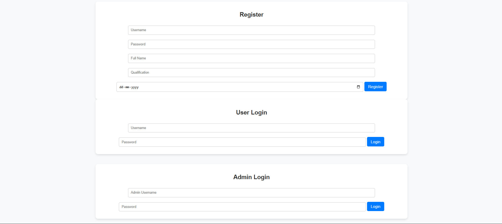

# Quiz App

## 📌 Overview

This is a Flask-based Quiz Application that allows users to:

Register and log in as a user or admin.

Create quizzes with Multiple-choice questions.

Answer quizzes and submit responses.

View quiz results.

Restful API design.

SQLALCHEMY as ORM.

Javascript for dynamic loading and handling API responses.

## **Features**
### **Admin Functionalities**  
    **User Management** – Manage subjects, chapters, quizzes, and questions  
    **Quiz Creation** – Add quizzes with multiple questions  
    **Admin Dashboard** – View subjects, quizzes, and question statistics  
    **Performance Summary** – Analyze user scores and quiz attempts  

### **User Functionalities**  
    **User Registration & Login**  
    **Attempt Quizzes** – Multiple-choice questions with time duration  
    **View Score History** – See past quiz attempts  
    **Performance Summary** – Graphical representation of quiz performance  

## 🖼️ Dashboard Screenshots (Click on image for full view)

### 🏠 Admin Dashboard (You can add, edit, delete subjects, chapters and quizzes and view summary)

  
  

  
  

### 🕒 User Dashboard (You can view all subjects, chapters and quizzes and attempty any quiz only once and view summary)

  
  

  
  

## **Tech Stack**
- **Backend:** Flask (Python)
- **Frontend:** Jinja2, HTML, CSS, Bootstrap
- **Database:** SQLite
- **Libraries Used:** Flask-SQLAlchemy, Flask-WTF

## 🛠️ Installation & Setup

### 1️⃣ Clone the Repository

git clone https://github.com/23f2002880/quiz_master_23f2002880.git

cd quiz-app  (enter to the directory)

### 2️⃣ Create & Activate a Virtual Environment (ignore if running your own env)

### On Windows  

python -m venv venv  
Set-ExecutionPolicy Unrestricted -Scope Process  (if aliasing issue)  
venv\Scripts\activate  

### On macOS/Linux  
python3 -m venv venv  
source venv/bin/activate  

### 3️⃣ Install Dependencies  
pip install flask flask_sqlalchemy flask_migrate flask_restful sqlalchemy Werkzeug  
### 4️⃣ Database is already set up.  

Admin Credentials:  

username : admin    
password : admin123  

Dummy user credentilas:   

username : user1   
password : password   

### 5️⃣ Run the Application   
python app.py   

The server will start at: http://127.0.0.1:5000
