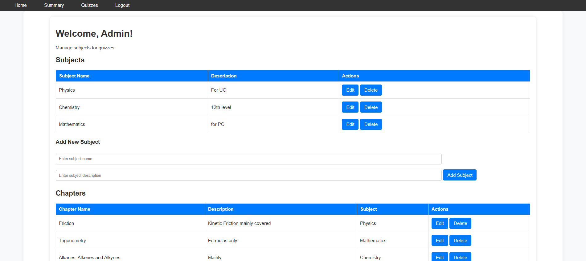
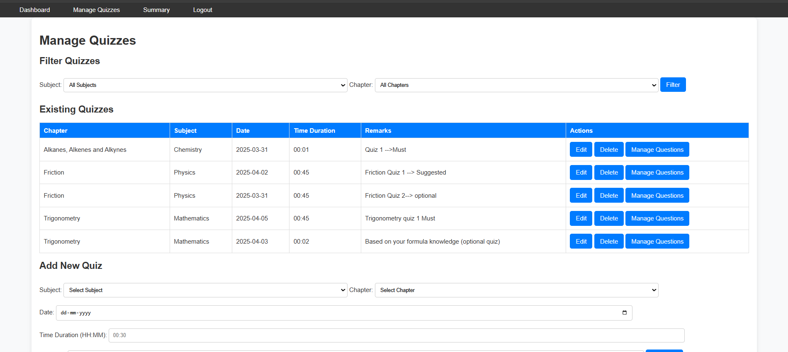
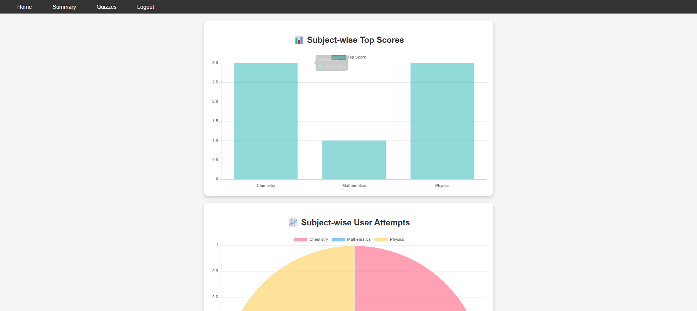
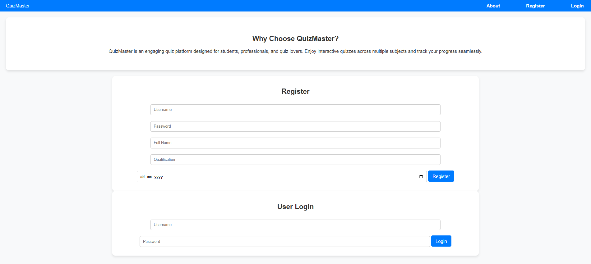
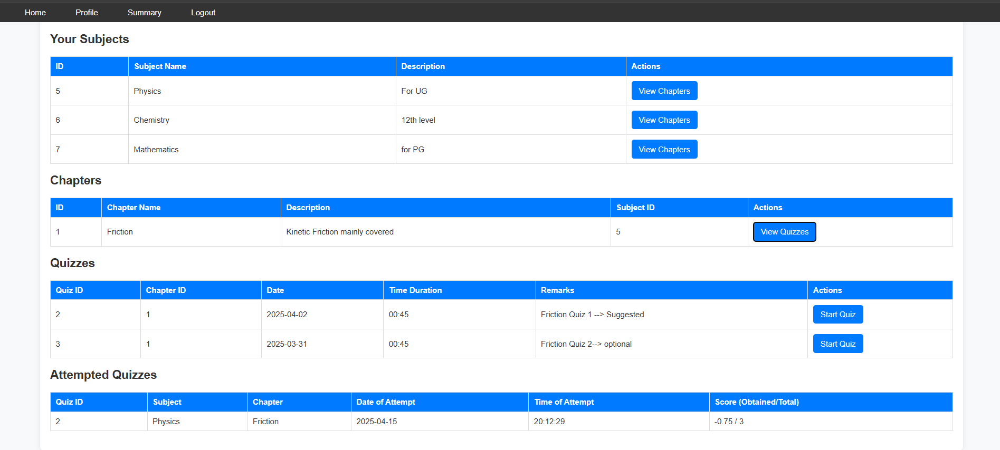
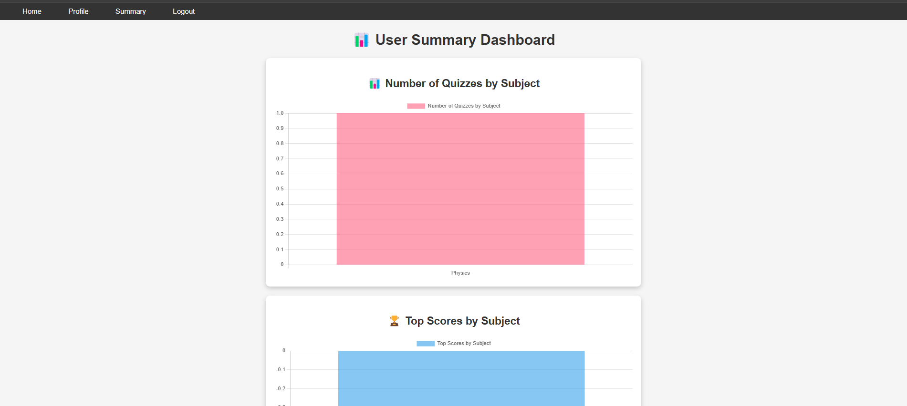
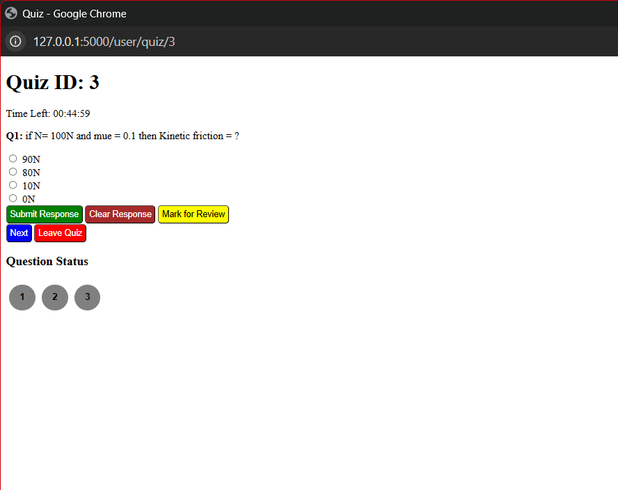

# 🎯 Quiz Web App

## 📚 Project Overview

**Quiz App** is a **multi-user exam preparation platform** designed to streamline quiz creation and assessment.  
- **Admins** can create quizzes, manage content, and track user performance.  
- **Users** can register, attempt quizzes, and review performance analytics.

> Built using **Flask**, with RESTful APIs, SQLAlchemy ORM, and dynamic frontend integration using **JavaScript**.

---

## 🚀 Key Features

### 👩‍🏫 Admin Functionalities
- 🧑‍🏫 **User Management**: Create and manage subjects, chapters, quizzes, and questions  
- 📝 **Quiz Creation**: Add multiple-choice questions to quizzes  
- 📊 **Admin Dashboard**: Visualize subjects, quiz counts, and statistics  
- 📈 **Performance Summary**: Analyze user attempts and scores  

### 🙋‍♂️ User Functionalities
- 🔐 **User Registration & Login**  
- 🧠 **Attempt Quizzes**: Timed multiple-choice questions  
- 🕒 **Score History**: View previous attempts and results  
- 📉 **Performance Summary**: Track progress with graphs and stats  

---

## 🖼️ Dashboard Screenshots

### 🏠 Admin Dashboard
Manage content, view stats, and create quizzes effortlessly:

<p align="center">
  
  
</p>
<p align="center">
  
  
</p>

---

### 👨‍🎓 User Dashboard
Browse and attempt quizzes, track your history:

<p align="center">
  
  
</p>
<p align="center">
  
  
</p>

---

## 🧰 Tech Stack

- **Backend:** Flask (Python)  
- **Frontend:** HTML, CSS, Bootstrap, Jinja2  
- **Database:** SQLite  
- **Libraries:** `Flask-SQLAlchemy`, `Flask-WTF`, `Flask-Migrate`, `Flask-RESTful`, `Werkzeug`

---

## 🛠️ Installation & Setup

### 🔀 1. Clone the Repository
```bash
git clone https://github.com/Keshav-CUJ/Quiz-Web-App.git
cd Quiz-Web-App
```

### 🧪 2. Create & Activate Virtual Environment

#### 🪠 Windows:
```bash
python -m venv venv
Set-ExecutionPolicy Unrestricted -Scope Process
venv\Scripts\activate
```

#### 🍏 macOS/Linux:
```bash
python3 -m venv venv
source venv/bin/activate
```

### 📦 3. Install Dependencies
```bash
pip install flask flask_sqlalchemy flask_migrate flask_restful sqlalchemy Werkzeug
```

> ✅ *No need to create database — already set up.*

---

## 🔐 Login Credentials

### Admin:
- **Username:** `admin`  
- **Password:** `admin123`

### Dummy User:
- **Username:** `user1`  
- **Password:** `password`

---

### ▶️ 4. Run the Application
```bash
python app.py
```

App will be live at:  
👉 **http://127.0.0.1:5000**

---

> For contributions, feature requests, or issues, feel free to open a pull request or raise an issue!

